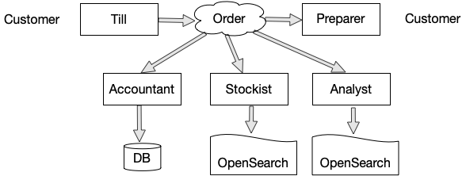
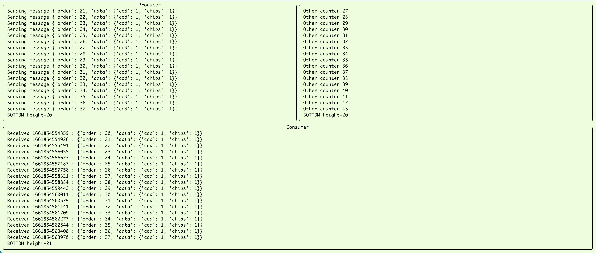
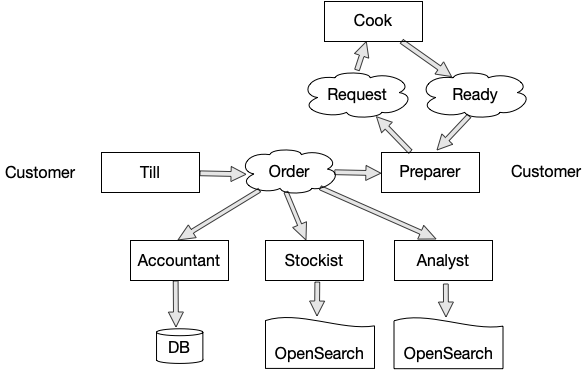

Fish and Chips and Apache Kafke®
================================

.. class:: title-slide-info

    By Tibs / Tony Ibbs (they / he)

    .. raw:: pdf

       Spacer 0 30

    Slides and accompanying material at https://github.com/tibs/fish-and-chips-and-kafka-talk

.. footer::

   *tony.ibbs@aiven.io* / *@much_of_a*

   .. Add a bit of space at the bottom of the footer, to stop the underlines
      running into the bottom of the slide
   .. raw:: pdf

      Spacer 0 5

What we'll cover
----------------

* Me and messaging and Apache Kafka®
* Fish and chips

  * How to talk to Kafka
  * Start with a simple model and work up
  * There's a demo you can play with afterwards

Some message problems I've cared about
--------------------------------------

* between components on a Set Top Box

* to / from Internet of Things devices, and their support systems

* configuration between microservices

Kafka is a very good fit for the IoT cases, maybe less so for the others

What I want from messaging
--------------------------

* multiple producers *and* multiple consumers
* single delivery
* guaranteed delivery
* resumes safely if system crashes
* no back pressure handling (queue does not fill up)

..
   Why not use a database?
   -----------------------

   I've seen people do this.

   It means you have to implement all the actual *messaging* stuff yourself

Enter, Apache Kafka®
--------------------

Messages are *Events*

Can have multiple *Producers* and *Consumers*

A Producer send a message to a named *Topic*,
each Consumer reads from one Topic

*Partitions* can be used to "spread the load" within a Topic

  Messages go to a partition based on their *Key*, and Consumers read from one or
  more partitions in their chosen Topic

Let's model a fish-and-chip shop
--------------------------------

We start with a shop that

* just handles cod and chips
* which are always ready to be served

Participants for an order
-------------------------

.. I need to improve the images (!)
   Also, probably worth trying out SVG to see if that's better quality

Serving a customer
------------------

.. raw:: pdf

   Spacer 0 30

.. TILL -> [ORDER] -> FOOD-PREPARER -> [READY] -> COUNTER

An order
--------

.. code:: json

   {
      "order": 271,
      "customer": "Tibs",
      "parts": [
          ["cod", "chips"],
          ["chips", "chips"],
      ]
   }

Picture of demo
---------------

.. The demo window was set to 211x41, with the text size increased 4 times,
   and I captured just the "text" portion. I think bigger text would help, and
   the aspect ratio could be improved.

   It's also probably worth creating a new page format that allows me to use
   more of the slide without causing the next slide to be a blank widow slide.

Libraries
---------

`kafka-python`: https://github.com/dpkp/kafka-python

`aiokafka`: https://github.com/aio-libs/aiokafka

`Textual`: https://github.com/Textualize/textual

Code: Producer
--------------

.. code:: python

    from kafka import KafkaProducer

    producer = kafka.KafkaProducer(
        bootstrap_servers=f"{HOST}:{SSL_PORT}",
        security_protocol="SSL",
        ssl_cafile=f'{certs_dir}/ca.pem',
        ssl_certfile=f'{certs_dir}/service.cert',
        ssl_keyfile=f'{certs_dir}/service.key',
        value_serializer=lambda v: json.dumps(v).encode('ascii'),

    while SHOP_IS_OPEN:
        # get order from CUSTOMER
        producer.sendi('ORDER'), order)

Code: Consumer
--------------

.. code:: python

    from kafka import KafkaConsumer

    consumer = KafkaConsumer(
        "ORDER",
        bootstrap_servers=f"{HOST}:{SSL_PORT}",
        security_protocol="SSL",
        ssl_cafile="ca.pem",
        ssl_certfile="service.cert",
        ssl_keyfile="service.key",
        value_deserializer = lambda v: json.loads(v.decode('ascii')),
    )

    for msg in consumer:
        print(f'Message {msg.value}')

Code: Asynchronous - needs SSL context
--------------------------------------

.. code:: python

    import aiokafka.helpers

    context = aiokafka.helpers.create_ssl_context(
        cafile=CERTS_DIR / "ca.pem",
        certfile=CERTS_DIR / "service.cert",
        keyfile=CERTS_DIR / "service.key",
    )

Code: Asynchronous Producer
---------------------------

.. code:: python

    from aiokafka import AIOKafkaProducer

    producer = aiokafka.AIOKafkaProducer(
        bootstrap_servers=f"{HOST}:{SSL_PORT}",
        security_protocol="SSL",
        ssl_context=context,
        value_serializer=lambda v: json.dumps(v).encode('ascii'),
    )

    await producer.start()

    while SHOP_IS_OPEN:
        # get order from CUSTOMER
        await producer.send_and_wait('ORDERS', message)

Code: Asynchronous Consumer
---------------------------

.. code:: python

    consumer = aiokafka.AIOKafkaConsumer(
        'ORDERS',
        bootstrap_servers=f"{HOST}:{SSL_PORT}",
        security_protocol="SSL",
        ssl_context=context,
        value_deserializer = lambda v: json.loads(v.decode('ascii')),
    )

    await consumer.start()

    async for message in consumer:
        print(f'Received {message.value}')

We just looked at
-----------------

.. raw:: pdf

   Spacer 0 30

.. TILL -> [ORDER] -> FOOD-PREPARER -> [READY] -> COUNTER

Other participants (adding Business Value)
------------------------------------------

What we need in the (consumer creation) code
--------------------------------------------

... to make the new participants start from the start of the events

.. code:: python

        auto_offset_reset="earliest",

(the default is `"latest"`)

*To be added: talking about starting at other offsets*

Picture of demo: 1
------------------

.. note:: This demo has a toggle button to switch on the other participants.
          In this picture it is OFF.

Picture of demo: 2
------------------

.. note:: Now the toggle button is ON, and we should be able to see that the
          ANALYST is looking at older entries, as they start from the
          beginning of the stream

Code: Consumer sending data to OpenSearch
-----------------------------------------

(demo only adds ANALYST)

.. note:: Code for this case - show the loop that gets the next event
   and sends it to OpenSearch

More customers - add queues
---------------------------

Customers now queue at multiple TILLs, each TILL is a Producer.

Use the *queue number* as the key to split the events up into partitions

  *(Automatically split N queues between <N partitions as the number of
  partitions is increased (so it would be nice if these are both controllable
  in the demo)*

Diagram
-------

.. note:: Diagram with 3 TILLs but still 1 FOOD-PREPARER

An order with queues
--------------------

.. code:: json

   {
      "order": 271,
      "customer": "Tibs",
      "queue": 3,
      "parts": [
          ["cod", "chips"],
          ["chips", "chips"],
      ]
   }

How we alter the code
---------------------

.. code:: python

    # Use a key for hashed-partitioning
    producer.send('ORDERS', key=b'queue', value=order)

Demo picture: multiple producers
--------------------------------

.. note:: A picture of the demo showing multiple producers

But now the FOOD-PREPARER is too busy
-------------------------------------

So add multiple *consumers*

.. note:: Diagram with 3 TILLs and 2 FOOD-PREPARER (i.e., 3 > 2)

How we alter the code
---------------------

.. note:: Code

Demo picture: multiple producers and consumers
----------------------------------------------

.. note:: A picture of the demo showing multiple producers and multiple consumers

Summary so far
--------------

We know how to model the ordering and serving of our cod and chips

We know how to share the order information with other data users

We know how to scale with multiple Producers and Consumers

Cod or plaice
-------------

Plaice needs to be cooked

So we need a COOK to cook it

Participant changes - add COOK
------------------------------

An order with plaice
--------------------

.. code:: json

   {
      "order": 271,
      "customer": "Tibs",
      "queue": 3,
      "parts": [
          ["cod", "chips"],
          ["chips", "chips"],
          ["plaice", "chips"],
      ]
   }

Picture of demo with COOK added
-------------------------------

.. note:: Picture of demo now we've got the COOK

Sophisticated model, with caching
---------------------------------

Use a Redis cache to simulate the hot cabinet

...only a brief explanation

Apache Kafka Connectors
-----------------------

These make it easier to connect Kafka to databases, OpenSearch, etc., without
needing to write Python (or whatever) code.

Final summary
-------------

We know how to model the ordering and serving of our cod and chips

We know how to share the order information with other data users

We know how to scale with multiple Producers and Consumers

We had a brief look at modelling "plaice" orders

We talked briefly about how one might model the hot cabinet in more detail

Acknowledgements
----------------

Apache,
Apache Kafka,
Kafka,
are either registered trademarks or trademarks of the Apache Software Foundation in the United States and/or other countries

OpenSearch and
PostgreSQL,
are trademarks and property of their respective owners.

.. I think I can omit the ``*`` in the context of the slides

Redis is a registered trademark of Redis Ltd. Any rights therein are reserved to Redis Ltd.

.. -----------------------------------------------------------------------------

.. raw:: pdf

    PageBreak twoColumnNarrowRight

Fin
---

Get a free trial of Aiven services at
https://console.aiven.io/signup/email

Also, we're hiring! See https://aiven.io/careers

Written in reStructuredText_, converted to PDF using rst2pdf_

..
    |cc-attr-sharealike| This slideshow is released under a
    `Creative Commons Attribution-ShareAlike 4.0 International License`_

Slides and accompanying material
|cc-attr-sharealike|
at https://github.com/tibs/fish-and-chips-and-kafka-talk

.. image:: images/qr_fish_chips_kafka.png
    :align: right
    :scale: 90%

.. And that's the end of the slideshow

.. |cc-attr-sharealike| image:: images/cc-attribution-sharealike-88x31.png
   :alt: CC-Attribution-ShareAlike image
   :align: middle

.. _`Creative Commons Attribution-ShareAlike 4.0 International License`: http://creativecommons.org/licenses/by-sa/4.0/

.. _`Write the Docs Prague 2022`: https://www.writethedocs.org/conf/prague/2022/
.. _reStructuredText: http://docutils.sourceforge.net/docs/ref/rst/restructuredtext.html
.. _rst2pdf: https://rst2pdf.org/
.. _Aiven: https://aiven.io/
.. _`Write the Docs slack`: https://writethedocs.slack.com
.. _`#testthedocs`: https://writethedocs.slack.com/archives/CBWQQ5E57
