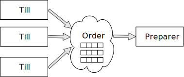
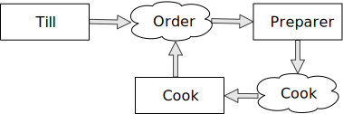

Fish and Chips and Apache Kafka®
================================

.. class:: title-slide-info

    By Tibs (they / he)

    .. raw:: pdf

       Spacer 0 30

    Slides and accompanying material at https://github.com/tibs/fish-and-chips-and-kafka-talk

.. footer::

   *tony.ibbs@aiven.io* / *@much_of_a*

   .. Add a bit of space at the bottom of the footer, to stop the underlines
      running into the bottom of the slide
   .. raw:: pdf

      Spacer 0 5

What we'll cover
----------------

* Me and messaging and Apache Kafka®
* Fish and chips

  * How to talk to Kafka
  * Start with a simple model and work up
  * There's a demo you can play with afterwards

Some message problems I've cared about
--------------------------------------

* between components on a Set Top Box

* configuration between microservices

* to / from Internet of Things devices, and their support systems

Kafka is a very good fit for the IoT cases, maybe less so for the others

.. Respectively, maybe want:

   * zeromq or similar - lightweight, fast (or, of course kbus <smile>)
   * a state machine and/or a persistent key/value store
   * Apache Kafka

What I want from messaging
--------------------------

* multiple producers *and* multiple consumers
* single delivery
* guaranteed delivery
* resumes safely if system crashes
* no back pressure handling (queue does not fill up)

Enter, Apache Kafka®
--------------------

.. Actually give the high-level explanation of what Kafka *is*

.. image:: images/kafka-logo-wide.png
   :width: 60%

Kafka terms
-----------

Messages are *Events*

*Producers* send messages, *Consumers* read them.

Can have multiple Producers and Consumers

A Producer send a message to a named *Topic*,
each Consumer reads from a single Topic

*Partitions* can be used to "spread the load" within a Topic

Producers, topics, consumers
----------------------------

.. raw:: pdf

   Spacer 0 30

.. image:: images/kafka1-overview.svg
   :width: 100%

Events
------

Multiple produces, multiple consumers
-------------------------------------

.. image:: images/kafka3-overview.svg
   :width: 80%

Multiple partitions, consumer groups
------------------------------------

Let's model a fish-and-chip shop
--------------------------------

We start with a shop that

* just handles cod and chips
* which are always ready to be served

Glossary
--------

.. I'm sure everyone loves a glossary

* **Cod**: the traditional white fish for english fish-and-chip shops
* **Chips**: fatter, possibly soggier, french fries
* **Plaice**: a flat fish
* **Till**: a cash register

Serving a customer
------------------

   .. raw:: pdf

      Spacer 0 30

..
   .. TILL -> [ORDER] -> FOOD-PREPARER

An order
--------

.. code:: json

   {
      "order": 271,
      "parts": [
          ["cod", "chips"],
          ["chips", "chips"],
      ]
   }

Show first demo
---------------

.. Yes, this is deliberately repeating the image from above,
   because this is what I intend to demo

.. raw:: pdf

   Spacer 0 30

.. TILL -> [ORDER] -> FOOD-PREPARER

Libraries
---------

`kafka-python`: https://github.com/dpkp/kafka-python

`aiokafka`: https://github.com/aio-libs/aiokafka

`Textual`: https://github.com/Textualize/textual

Code: Producer
--------------

.. code:: python

    from kafka import KafkaProducer

    producer = kafka.KafkaProducer(
        bootstrap_servers=f"{HOST}:{SSL_PORT}",
        security_protocol="SSL",
        ssl_cafile=f'{certs_dir}/ca.pem',
        ssl_certfile=f'{certs_dir}/service.cert',
        ssl_keyfile=f'{certs_dir}/service.key',
        value_serializer=lambda v: json.dumps(v).encode('ascii'),

    while SHOP_IS_OPEN:
        # get order from CUSTOMER
        producer.send('ORDER'), order)

Code: Consumer
--------------

.. code:: python

    from kafka import KafkaConsumer

    consumer = KafkaConsumer(
        "ORDER",
        bootstrap_servers=f"{HOST}:{SSL_PORT}",
        security_protocol="SSL",
        ssl_cafile="ca.pem",
        ssl_certfile="service.cert",
        ssl_keyfile="service.key",
        value_deserializer = lambda v: json.loads(v.decode('ascii')),
    )

    for msg in consumer:
        print(f'Message {msg.value}')

Code: Asynchronous - needs SSL context
--------------------------------------

.. code:: python

    import aiokafka.helpers

    context = aiokafka.helpers.create_ssl_context(
        cafile=CERTS_DIR / "ca.pem",
        certfile=CERTS_DIR / "service.cert",
        keyfile=CERTS_DIR / "service.key",
    )

Code: Asynchronous Producer
---------------------------

.. code:: python

    from aiokafka import AIOKafkaProducer

    producer = aiokafka.AIOKafkaProducer(
        bootstrap_servers=f"{HOST}:{SSL_PORT}",
        security_protocol="SSL",
        ssl_context=context,
        value_serializer=lambda v: json.dumps(v).encode('ascii'),
    )

    await producer.start()

    while SHOP_IS_OPEN:
        # get order from CUSTOMER
        await producer.send_and_wait('ORDERS', message)

Code: Asynchronous Consumer
---------------------------

.. code:: python

    consumer = aiokafka.AIOKafkaConsumer(
        'ORDERS',
        bootstrap_servers=f"{HOST}:{SSL_PORT}",
        security_protocol="SSL",
        ssl_context=context,
        value_deserializer = lambda v: json.loads(v.decode('ascii')),
    )

    await consumer.start()

    async for message in consumer:
        print(f'Received {message.value}')

More customers - add more TILLs
-------------------------------

Customers now queue at multiple TILLs, each TILL is a Producer.

Use the *till number* as the key to split the events up into partitions

Three tills
-----------

..
   Diagram with 3 TILLs but still 1 FOOD-PREPARER ::

     TILL
         \
     TILL -> [ORDER with partitions] -> FOOD-PREPARER
         /
     TILL

An order with multiple TILLs
----------------------------

.. code:: json

   {
      "order": 271,
      "till": 3,
      "parts": [
          ["cod", "chips"],
          ["chips", "chips"],
      ]
   }

How we alter the code
---------------------

When creating the topic for the demo, request 3 partitions:

  .. code:: python

        NewTopic(
            name='DEMO2-ORDERS',
            num_partitions=3,
            replication_factor=1,
        )

.. raw:: pdf

   Spacer 0 10

Create 3 Till producers instead of 1

.. Consider a screen shot to show we've got 3 partitions in use

Show demo: multiple TILLs
-------------------------

.. The multiple tills picture again

..
   ::

     TILL
         \
     TILL -> [ORDER with partitions] -> FOOD-PREPARER
         /
     TILL

But now the FOOD-PREPARER is too busy
-------------------------------------

Add multiple *consumers*
------------------------

..
   ::

     TILL                             > FOOD-PREPARER
         \                           /
     TILL -> [ORDER with partitions] -> FOOD-PREPARER
         /                           \
     TILL                             > FOOD-PERPARER

How we alter the code
---------------------

Send to different partitions

.. code:: python

    await producer.send(TOPIC_NAME, value=order, partition=self.instance_number-1)

Consumers need to be in same *consumer group*

.. code:: python

    consumer = aiokafka.AIOKafkaConsumer(
       ...
       group_id=CONSUMER_GROUP,
       ...

Start consuming from a specific offset
--------------------------------------

*If I run a demo more than once, there's a chance that a consumer might
receive events from the previous demo. So we want to make sure that doesn't
happen.*

Various solutions - simplest for this case is to do:

.. code:: python

    await consumer.seek_to_end()

Show demo: multiple TILLs and multiple FOOD-PREPARERS
-----------------------------------------------------

.. The multiple tills picture again

..
   ::

     TILL                             > FOOD-PREPARER
         \                           /
     TILL -> [ORDER with partitions] -> FOOD-PREPARER
         /                           \
     TILL                             > FOOD-PERPARER

Cod or plaice
-------------

Plaice needs to be cooked

So we need a COOK to cook it

.. Keep it to the simple cod-and-chips order from demo 1, with COOK added, so it
   isn't too complicated to explain

Participant changes - add COOK
------------------------------

.. raw:: pdf

   Spacer 0 10

..
   ::

     TILL -> [ORDER] -> FOOD-PREPARER
                ^         |
                |      [COOK]
                |         |
                |         V
                +------- COOK

An order with plaice
--------------------

.. code:: json

   {
      "order": 271,
      "till": 3,
      "parts": [
          ["cod", "chips"],
          ["chips", "chips"],
          ["plaice", "chips"],
      ]
   }

Gets turned into...
-------------------

.. code:: json

   {
      "order": 271,
      "till": 3,
      "parts": [
          ["cod", "chips"],
          ["chips", "chips"],
          ["plaice", "chips"],
      ],
      "ready": <boolean>
   }

Code changes to add COOK
------------------------

.. code:: python

    def all_order_available(self, order):
        if 'ready' not in order:
            all_items = itertools.chain(*order['order'])
            order['ready'] = 'plaice' not in all_items

.. code:: python

        order_available = self.all_order_available(order)
        if order_available:
            await asyncio.sleep(random.uniform(PREP_FREQ_MIN, PREP_FREQ_MAX))
            # Say order is finished
        else:
            await self.producer.send(TOPIC_NAME_COOK, order)

In the Cook
-----------

.. code:: python

   async for message in consumer:
      ...
      # "Cook" the (plaice in the) order
      await asyncio.sleep(random.uniform(COOK_FREQ_MIN, COOK_FREQ_MAX))
      # It's important to remember to mark the order as ready now!
      # (forgetting to do that means the order will keep going round the loop)
      order['ready'] = True
      await self.producer.send(TOPIC_NAME_ORDERS, order)

..
   ** All orders have a "ready" boolean, which is initially set to False
   * The PREPARER gets the ORDER

     * If the order has "ready" set to True, then everything is available from
       the hot cabinet, the order can be made up and passed to the customer

     * If the order has "ready" set to False, and there is no "plaice" in
       the order, then the PREPARER sets "ready" to True (everything can be made
       up from the hot cabinet) and the order is done

     * If the order has "ready" set to False, but there is "plaice" in the order,
       then the order is sent to the [COOK] topic for the COOK. The COOK sets the
       "ready" boolean to True, and sends the order back to the [ORDER] topic.

   This allows the PREPARER to continue with just one topic to listen to, at the
   penalty of being a little bit horrible (it would get better if/when the Redis
   cache is provided, because then the check for "ready" would be replaced by a
   check against the cache).

   Question: do we want a separate partition for orders from the COOK? Or do we
   want a random partition? (either explicitly or implicitly random)

Demo with COOK
--------------

Show demo of (simple) cod-and-chips order, with COOK

.. Keep it to the simple cod-and-chips order from demo 1, with COOK added, so it
   isn't too complicated to explain

Summary so far
--------------

We know how to model the ordering and serving of our cod and chips

We know how to scale with multiple Producers and Consumers

We made a simple model for orders with plaice

Homework 1: Adding the ANALYST
------------------------------

   .. raw:: pdf

      Spacer 0 10

..
   ::

     TILL -> [ORDER] -> FOOD-PREPARER
                     \
                      +-> ANALYST -> PG

.. image:: images/homework-kafka-magic.svg
   :width: 100%

Using Kafka Connect
-------------------

   .. raw:: pdf

      Spacer 0 10

..
   ::

     TILL -> [ORDER] -> FOOD-PREPARER
                     \
                      +-> ANALYST -> PG

..
   Keep it to the simple cod-and-chips order from demo 1, with ANALYST added, so it
   isn't too complicated to explain. Show some query result from the PG databse
   being updated - perhaps just total number of orders.

..
   Two ways to do the ANALYST
   --------------------------

   1. Add a new (independent) consumer of [ORDER], and have them write to
      PostgreSQL®

   2. Use an Apache Kafka® Connector to connect the [ORDER] topic to PostgreSQL
      without needing to alter the Python code

   If I do (1), then we get to choose when to start the ANALYST consuming, and I
   can do the toggle to start it. But (2) introduces something nice to know
   about, and is probably more realistic.

   (Option 1) What we need to do in the code
   -----------------------------------------

   ... *add code for ANALYST consumer, and make it write to PG*

   ... *add code to read some sort of statistic from PG and report as it changes*

   (Option 1) Demo with ANALYST
   ----------------------------

   ::

     TILL -> [ORDER] -> FOOD-PREPARER
                     \
                      +-> ANALYST -> PG

   *Maybe with a toggle button to start the ANALYST*

Apache Kafka Connectors
-----------------------

These make it easier to connect Kafka to databases, OpenSearch, etc., without
needing to write Python (or whatever) code.

How I would do it
-----------------

The Aiven developer documentation
has instructions on how to do this at
https://docs.aiven.io/docs/products/kafka/kafka-connect/howto/jdbc-sink.html

* Create an appropriate PostgreSQL database and table
* Make sure that the Kafka service has Kafka Connect enabled
* Use the Aiven web console to setup the new connector

And then add code to the Python demo to query PostgreSQL and make some sort of
report over time.

..
   Demo with ANALYST
   -----------------

   ::

     TILL -> [ORDER] -> FOOD-PREPARER
                     \
                      +-> ANALYST -> PG

Homework 2: Model cooking the fish and chips
--------------------------------------------

Use a Redis cache to simulate contents of the hot cabinet

Redis has entries for the hot cabinet content, keyed by ``cod``, (portions of)
``chips`` and ``plaice``. We start with 0 for all of them.

Using the cache
---------------

PREPARER compares the order to the counts in the cache. If there's enough
"stuff" to make the order up, decrements the cache appropriately, and that's
done

If not, sends the order to the COOK

COOK updates the cache - for ``plaice``, adds as many as are needed, for
the others, if they go below a threshold, adds a standard quantity back in
("cooking in batches"). Then sends the order back to the [ORDER] topic

.. This last is why the slightly icky "setting a boolean flag" trick isn't so
   bad, as it is sort of simulating what we are doing above. It would be worth
   explaining this, at this point

Start of day
------------

.. raw:: pdf

   Spacer 0 10

.. image:: images/homework-redis-1.svg
   :width: 70%

Cod and chips
-------------

.. raw:: pdf

   Spacer 0 10

.. image:: images/homework-redis-2.svg
   :width: 100%

Plaice and chips
----------------

.. image:: images/homework-redis-3.svg
   :width: 90%

Final summary
-------------

We know how to model the ordering and serving of our cod and chips

We know how to scale with multiple Producers and Consumers

We made a simple model for orders with plaice

We talked briefly about using Kafka Connectors to share data with other data users

We talked briefly about how one might model the hot cabinet in more detail

Acknowledgements
----------------

Apache,
Apache Kafka,
Kafka,
and the Kafka logo
are either registered trademarks or trademarks of the Apache Software Foundation in the United States and/or other countries

Postgres and PostgreSQL are trademarks or registered trademarks of the
PostgreSQL Community Association of Canada, and used with their permission

.. I think I can omit the Redis ``*`` in the context of the slides

Redis is a registered trademark of Redis Ltd. Any rights therein are reserved to Redis Ltd.

.. -----------------------------------------------------------------------------

.. raw:: pdf

    PageBreak twoColumnNarrowRight

Fin
---

Get a free trial of Aiven services at
https://console.aiven.io/signup/email

Also, we're hiring! See https://aiven.io/careers

Written in reStructuredText_, converted to PDF using rst2pdf_

..
    |cc-attr-sharealike| This slideshow is released under a
    `Creative Commons Attribution-ShareAlike 4.0 International License`_

Slides and accompanying material
|cc-attr-sharealike|
at https://github.com/tibs/fish-and-chips-and-kafka-talk

.. And that's the end of the slideshow

.. |cc-attr-sharealike| image:: images/cc-attribution-sharealike-88x31.png
   :alt: CC-Attribution-ShareAlike image
   :align: middle

.. _`Creative Commons Attribution-ShareAlike 4.0 International License`: http://creativecommons.org/licenses/by-sa/4.0/

.. _`Write the Docs Prague 2022`: https://www.writethedocs.org/conf/prague/2022/
.. _reStructuredText: http://docutils.sourceforge.net/docs/ref/rst/restructuredtext.html
.. _rst2pdf: https://rst2pdf.org/
.. _Aiven: https://aiven.io/
.. _`Write the Docs slack`: https://writethedocs.slack.com
.. _`#testthedocs`: https://writethedocs.slack.com/archives/CBWQQ5E57
