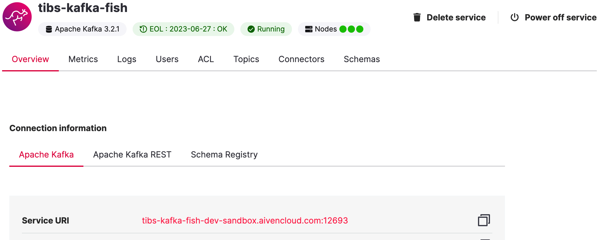
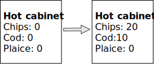
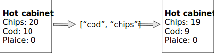

Slides that are not being used
==============================

Since I need to keep to 30 minutes

Some of the Aiven web console slides
------------------------------------

Web console
-----------

.. When the image fits the (default) page, it's rather too small to be useful

Demo 1 and demo 2 partitions
----------------------------

Demo 1, demo 2, demo 3 partitions
---------------------------------

From the ANALYST homework
-------------------------

Apache Kafka Connectors
-----------------------

These make it easier to connect Kafka to databases, OpenSearch, etc., without
needing to write Python (or whatever) code.

Pictures for the Redis homework
-------------------------------

Start of day
------------

.. raw:: pdf

   Spacer 0 10

Cod and chips
-------------

.. raw:: pdf

   Spacer 0 10

Plaice and chips
----------------

.. image:: images/homework-redis-3.svg
   :width: 90%
